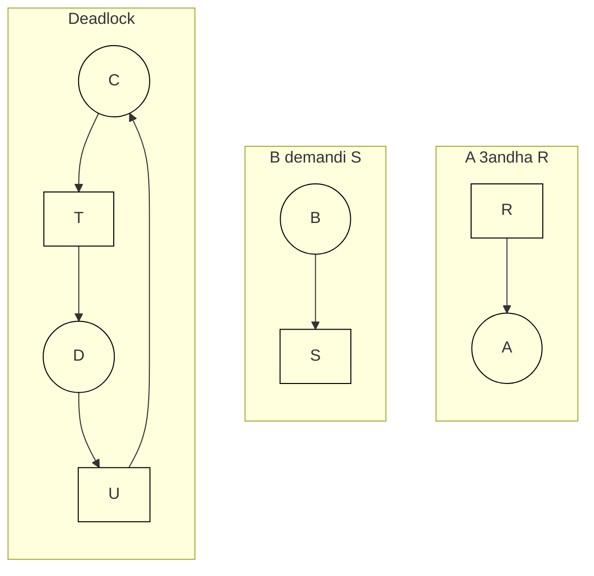

# Achya2at momila fel debut ta3 el cours
## **Definition:**
#### Deadlocks:
ki les processus y9ar3o un evenement jamais ghadi yewsal

---
# Achaya2at mofida

Ki ykon kayen cicle ma3netha kayen deadlock
# Fichiers Utiles
- [[SEXPCOURS5.pdf|Cours]]
- [[Sexp2DeadlockExercice|Exercices]]