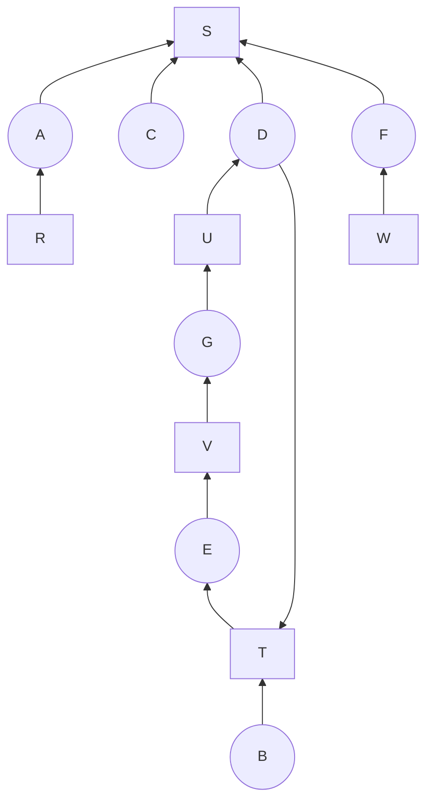
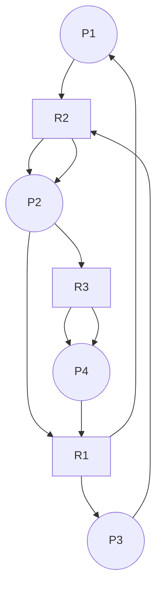

# **Exercice:**
## **Exercise 1**

#### Question 1

Considérons l'attribution des ressources suivante :

- A détient R et demande S ;
- B demande T ;
- C demande S ;
- D détient U et demande S et T ;
- E détient T et demande V ;
- F détient W et demande S ;
- G détient V et demande U.

Construire le graphe d'allocation des ressources. Y a‑t‑il un interblocage ? Si oui, quels sont les processus concernés ?

#### Question 2

Considérons un système gérant quatre processus, P1 à P4, et trois types de ressources R1, R2 et R3 (3 R1, 2 R2 et 2 R3). L'attribution des ressources :

- P1 détient une ressource de type R1 et demande une ressource de type R2.
- P2 détient 2 ressources de type R2 et demande une ressource de type R1 et une ressource de type R3.
- P3 détient 1 ressource de type R1 et demande une ressource de type R2.
- P4 détient 2 ressources de type R3 et demande une ressource de type R1.

Construire le graphe d'allocation des ressources. Y a‑t‑il un interblocage ? Si oui, quels sont les processus concernés ?
## **Exercise 2**
Considérer un système avec 03 process  (P1, P2 et P3) et 04 ressources  (R1, R2, R3, R4)

Le système permet au maximum
- 4 accès concurrents à R1
- 2 accès concurrents à R2
- 3 accès concurrents à R3
- 1 accès concurrents à R4

A l’instant t0
- P1 possède un accès à R3
- P2 possède deux accès à R1 et un accès à R4
- P3 possède un accès à R2 et deux accès à R3

Ressources demandées mais non encore allouées
- P1 demande deux accès à R1 et 1 accès à R4
- P2 demande un accès à R1 et 1 accès à R3
- P3 demande deux accès à R1 et 1 accès à R2

1. L’état courant est-il sûr (sain)?
2. Peut-on accorder 2 ressources R1 à P3 ?
3. Peut-on accorder 1 ressource R1 à P2 ?

# **Solution:**
## **Exercise 1**

#### Question 1

kayen un interblocage les processus concerné sont B,D,E,G
#### Question 2

Makanch interblocage

## **Exercise 2**
#### Question 1
Oui l'etat est sure
#### Question 2
Oui on peut
#### Question 3
Non yesra interblocages